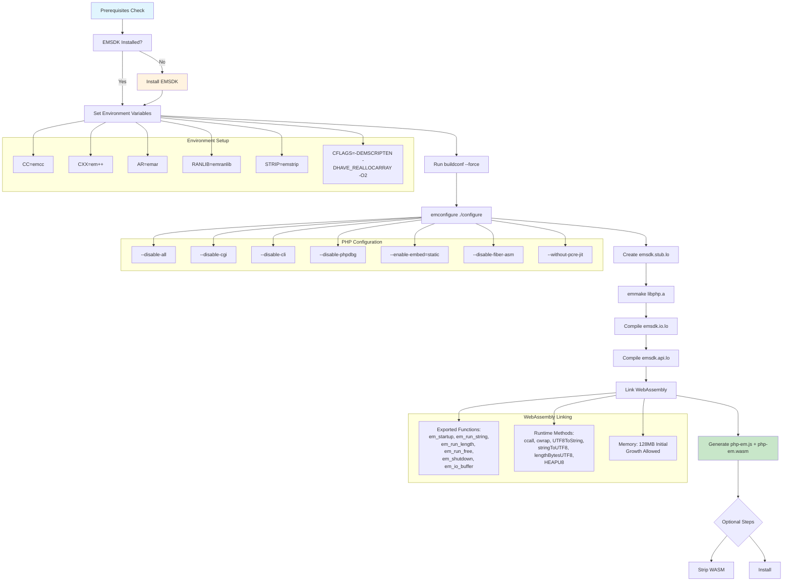

# Building PHP-EM (WebAssembly Build)

This document explains how to build the PHP-EM WebAssembly version of PHP with the ORT extension.

## Prerequisites

### Installing Emscripten SDK (EMSDK)

The WebAssembly build requires the Emscripten SDK. Follow these steps to install it:

#### 1. Download and Install EMSDK

```bash
# Clone the emsdk repository
git clone https://github.com/emscripten-core/emsdk.git
cd emsdk

# Fetch the latest version of the emsdk
./emsdk install latest

# Make the "latest" SDK "active" for the current user
./emsdk activate latest

# Activate PATH and other environment variables in the current terminal
source ./emsdk_env.sh
```

#### 2. Verify Installation

```bash
# Check that emcc is available
emcc --version

# Should output something like:
# emcc (Emscripten gcc/clang-like replacement + linker emulating GNU ld) 3.1.x
```

#### 3. Persistent Environment Setup

Add to your shell profile (`.bashrc`, `.zshrc`, etc.):

```bash
# Add EMSDK to PATH (adjust path as needed)
source /path/to/emsdk/emsdk_env.sh
```
### 4. Copy/clone into/for php-src

The files in this directory expect to be executed from the root of the `php-src` tree.

## Build Commands

### Quick Start

```bash
# Ensure EMSDK is activated
source /path/to/emsdk/emsdk_env.sh

# Build everything
make -f emsdk.mk all
```

### Step-by-Step Build

#### 1. Configure PHP

```bash
# Generate configure script and run emconfigure
make -f emsdk.mk config.status
```

This runs:
```bash
./buildconf --force
emconfigure ./configure \
    --disable-all \
    --disable-cgi \
    --disable-cli \
    --disable-phpdbg \
    --enable-embed=static \
    --disable-fiber-asm \
    --without-pcre-jit
```

#### 2. Build Components

```bash
# Build the stub component
make -f emsdk.mk emsdk.stub.lo

# Build PHP library
make -f emsdk.mk build

# Build API components
make -f emsdk.mk api

# Generate WebAssembly
make -f emsdk.mk wasm
```

### Individual Targets

| Target | Description |
|--------|-------------|
| `all` or `wasm` | Complete build (default) |
| `config.status` | Configure PHP for Emscripten |
| `emsdk.stub.lo` | Build EMSDK stub component |
| `build` | Build PHP static library |
| `api` | Build API components |
| `strip` | Strip debug symbols from WASM |
| `install` | Install built files |
| `clean` | Clean all build artifacts |
| `clean-emsdk` | Clean only EMSDK objects |
| `clean-wasm` | Clean only WASM outputs |

## Configuration Options

### Environment Variables

| Variable | Default | Description |
|----------|---------|-------------|
| `EMCONFIGURE` | `emconfigure` | Emscripten configure wrapper |
| `EMMAKE` | `emmake` | Emscripten make wrapper |
| `EMCFLAGS` | `-Imain -IZend -ITSRM -Iext/standard -I.` | Emscripten C flags |
| `EM_EXTRA_CONFIGURE` | (empty) | Extra configure options |
| `EM_EXTRA_COMPILE` | (empty) | Extra compile flags |
| `EM_EXTRA_LINK` | (empty) | Extra link flags |

### Customization Examples

```bash
# Add extra configure options
make -f emsdk.mk EM_EXTRA_CONFIGURE="--enable-ort --enable-ort-backend=wasm" all

# Add debugging flags
make -f emsdk.mk EM_EXTRA_COMPILE="-g -O0" EM_EXTRA_LINK="-g" all

# Optimize for size
make -f emsdk.mk EM_EXTRA_LINK="-Oz --closure 1" all
```

## PHP Configuration Details

The build uses a minimal PHP configuration:

- **Disabled**: All SAPIs (CGI, CLI, phpdbg)
- **Enabled**: Embedded SAPI only (static)
- **Disabled**: Fiber assembly optimizations
- **Disabled**: PCRE JIT compilation
- **Mode**: Static embedding for WebAssembly

### Memory Configuration

- **Initial Memory**: 128MB
- **Growth**: Allowed (dynamic allocation)
- **Format**: WebAssembly (WASM=1)

## Output Files

After successful build:

```bash
# Main outputs
php-em.js      # JavaScript wrapper and runtime
php-em.wasm    # WebAssembly binary

# File sizes (example)
-rw-r--r-- 1 user user 156K php-em.js
-rw-r--r-- 1 user user 8.2M php-em.wasm
```

## High-Level JavaScript API

The built WebAssembly module provides a simple, single-method JavaScript API that handles all PHP execution automatically.

### Core API Method

#### `Module.invoke(input, output)`
The only public-facing method for executing PHP code. The module automatically handles startup and shutdown internally.

**Input Options:**
- `string` - Direct PHP code
- `HTMLTextAreaElement` - Takes value from textarea
- `Function` - Must return `{value: string, length: number}`

**Output Options:**
- `undefined` - Returns text directly (default)
- `HTMLElement` - Sets `textContent` and returns text
- `Function` - Calls function with text, returns result

```javascript
// Simple string execution
let result = Module.invoke('<?php echo "Hello World!"; ?>');

// Using textarea input
let textarea = document.getElementById('code-input');
let output = Module.invoke(textarea);

// Using custom output handler
Module.invoke('<?php phpinfo(); ?>', function(text) {
    console.log('PHP Output:', text);
    return text;
});

// Using DOM element output
let outputDiv = document.getElementById('output');
Module.invoke('<?php echo date("Y-m-d H:i:s"); ?>', outputDiv);
```

### Automatic Lifecycle Management

The module handles initialization and cleanup automatically:
- **Startup**: PHP runtime initializes when WebAssembly loads (`onRuntimeInitialized`)
- **Ready State**: `Module.ready` indicates if initialization succeeded
- **Shutdown**: Automatic cleanup on page unload

### Event System

The API provides events for monitoring execution:

```javascript
// Listen for execution events
Module.addEventListener('invoke.begin', function(event) {
    console.log('Execution started', event.detail);
});

Module.addEventListener('invoke.end', function(event) {
    console.log('Execution completed', event.detail.text);
});

Module.addEventListener('invoke.error', function(event) {
    console.error('Execution error', event.detail);
});

Module.addEventListener('invoke.exception', function(event) {
    console.error('Runtime exception', event.detail.exception);
});
```

### Complete Usage Example

```javascript
// Load the WebAssembly module
Module().then(function(Module) {
    // Check if initialization was successful
    if (!Module.ready) {
        console.error('Failed to initialize PHP runtime');
        return;
    }
    
    // Set up event listeners (optional)
    Module.addEventListener('invoke.error', function(event) {
        console.error('PHP execution failed:', event.detail);
    });
    
    // Execute PHP code - that's it!
    try {
        let result = Module.invoke(`
            <?php
            echo "Current time: " . date('Y-m-d H:i:s') . "\\n";
            echo "PHP Version: " . PHP_VERSION . "\\n";
            
            // Your ORT extension code here
            if (extension_loaded('ort')) {
                echo "ORT extension is loaded!\\n";
            }
            ?>
        `);
        
        console.log('Output:', result);
    } catch (error) {
        console.error('Execution failed:', error);
    }
    
    // No need to call shutdown - handled automatically
});
```

### Advanced Input Handling

```javascript
// Custom input function
function getComplexCode() {
    let phpCode = `
        <?php
        $data = json_decode('${JSON.stringify(someData)}', true);
        foreach ($data as $item) {
            echo $item . "\\n";
        }
        ?>
    `;

    return {
        value: phpCode,
        length: Module.lengthBytesUTF8(phpCode)
    };
}

Module.invoke(getComplexCode, function(output) {
    // Process the output
    return output.trim().split('\n');
});
```

## Troubleshooting

### Common Issues

1. **EMSDK not found**
   ```bash
   # Solution: Activate EMSDK environment
   source /path/to/emsdk/emsdk_env.sh
   ```

2. **Build fails with "emcc not found"**
   ```bash
   # Verify EMSDK installation
   which emcc
   emcc --version
   ```

3. **Memory allocation errors**
   ```bash
   # Increase initial memory
   make -f emsdk.mk EM_EXTRA_LINK="-s INITIAL_MEMORY=256MB" all
   ```

4. **Missing dependencies**
   ```bash
   # Clean and rebuild
   make -f emsdk.mk clean
   make -f emsdk.mk
   ```

### Debug Build

For debugging, use:

```bash
make -f emsdk.mk EM_EXTRA_COMPILE="-g -O0" \
     EM_EXTRA_LINK="-g -s ASSERTIONS=1 -s SAFE_HEAP=1" \
     all
```

### Performance Optimization

For production builds:

```bash
make -f emsdk.mk EM_EXTRA_LINK="-Oz --closure 1 -s MODULARIZE=1" strip
```

## Integration with ORT Extension

To build with the ORT extension enabled:

```bash
make -f emsdk.mk EM_EXTRA_CONFIGURE=--enable-ort=static all
```

## Build Process Overview

