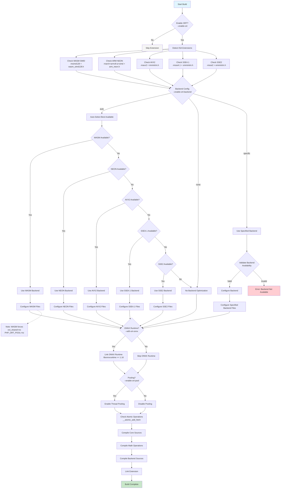

# Building the ORT PHP Extension

This document explains how to build the PHP-ORT extension with various configuration options.

### Core Options

| Option                         | Description                        | Default  |
|--------------------------------|------------------------------------|----------|
| `--enable-ort`                 | Enable the ORT extension           | disabled |
| `--enable-ort-backend[=TYPE]`  | Backend optimization type          | `auto`   |
| `--enable-ort-pool`            | Enable thread pooling              | `yes`    |
| `--with-ort-onnx`              | Enable ONNX Runtime support        | `no`     |

### Backend Types

- **`auto`**: Automatically select the best (as applicable) backend
- **`none`**: Disable backend optimizations
- **`wasm`**: WebAssembly SIMD backend (*nix only)
- **`neon`**: ARM NEON backend (*nix only)
- **`avx2`**: AVX2 backend
- **`sse41`**: SSE4.1 backend
- **`sse2`**: SSE2 backend

## Backend Priority Order

When using `--enable-ort-backend=auto`, backends are selected in this priority order:

1. **WASM** (highest priority)
2. **NEON**
3. **AVX2**
4. **SSE4.1**
5. **SSE2** (lowest priority)

## Special Considerations

### WASM Backend Notes

- Forces `ext_shared=no` (static linking only)
- Disables thread pooling (`PHP_ORT_POOL=no`)
- Requires in-tree builds (source directory must equal build directory)
- See [dist/emsdk](dist/emsdk) for building webasm runtime

### ONNX Runtime Integration

When `--with-ort-onnx` is enabled:
 - Requires `libonnxruntime >= 1.16`
 - Uses pkg-config for library detection
 - Adds additional source files for runtime support

Currently it's neceessary to fetch `libonnxruntime` releases from github:

```shell
$ wget https://github.com/microsoft/onnxruntime/releases/download/v1.22.0/onnxruntime-linux-x64-1.22.0.tgz -O onnxruntime-linux-x64-1.22.0.tgz
$ sudo tar -C /usr/local --strip-components=1 -xvzf /onnxruntime-linux-x64-1.22.0.tgz
$ sudo ldconfig # update dynamic linker cache
```

## Build Examples

### Optimized Build with Auto Backend
```bash
./configure --enable-ort --enable-ort-backend=auto
make
```

### Specific Backend Build
```bash
./configure --enable-ort --enable-ort-backend=avx2
make
```

### Full-Featured Build
```bash
./configure --enable-ort --enable-ort-backend=auto --with-ort-onnx --enable-ort-pool
make
```

### Minimal Build (No Optimizations, No Dependencies)
```bash
./configure --enable-ort --enable-ort-backend=none --disable-ort-pool
make
```

## Troubleshooting

### Common Issues

1. **Backend not available**: Ensure your compiler and system support the requested ISA extension
3. **WASM build fails**: See [dist/emsdk](dist/emsdk)
4. **Multiple backends conflict**: Only one backend can be enabled at a time

### Verification

During configure, the extension will report:
- Detected ISA extensions
- Selected backend configuration
- ONNX Runtime status
- Pooling configuration

## Build Flow Overview


